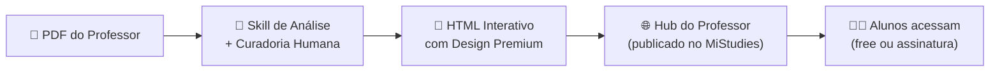

# Plano de Rentabilidade — MiStudies

> **3 sócios · 30h/semanais · Meta: R$3.600/mês (S1) · Foco: escala + assinatura + automação**
>
> **Data:** Abril 2026 · **Status:** Para aprovação dos sócios

---

## 1. Reposicionamento do Produto Core

O MiStudies não é apenas um hub de resumos. O produto core é um **serviço de transformação de conteúdo educacional**: o professor envia material bruto (PDF, slides, apostila) e recebe de volta uma **aula completa em HTML interativo** com design editorial premium.



### O que a "Skill de Análise" faz:
1. **Diagnóstico do material** — analisa estrutura, densidade, gaps, tom e nível técnico
2. **Pesquisa complementar** — busca fontes externas para enriquecer o conteúdo
3. **Reestruturação didática** — reorganiza fluxo, cria hierarquia visual, sintetiza
4. **Geração do HTML** — produz a aula interativa no padrão visual MiStudies
5. **Controle de qualidade** — revisão humana antes da entrega

---

## 2. Tiers de Serviço por Aula

Três níveis de transformação, com preços progressivos e valor percebido crescente.

### Tabela de Tiers

| | 📝 **Essencial** | ⚡ **Pro** | 🏆 **Premium** |
|---|---|---|---|
| **O que entrega** | HTML estático editorial | HTML interativo com elementos dinâmicos | HTML completo com funcionalidades avançadas |
| **Conteúdo** | Texto bem estruturado, hierarquia visual, tipografia premium | Tudo do Essencial + tabelas interativas, acordeões, tooltips, destaques | Tudo do Pro + quizzes, flashcards, modo apresentação, progresso |
| **Design** | Padrão MiStudies (tokens, tipografia, cores) | Padrão MiStudies + customização na paleta do professor | Identidade visual completa do professor |
| **Pesquisa externa** | Básica (complemento mínimo) | Moderada (3-5 fontes externas) | Profunda (pesquisa completa + glossário + referências) |
| **Responsivo** | ✓ | ✓ | ✓ |
| **Tempo de entrega** | 3-5 dias úteis | 5-7 dias úteis | 7-10 dias úteis |
| **Preço por aula** | **R$ 120** | **R$ 250** | **R$ 450** |

### Custo unitário estimado por aula (para vocês)

| Componente | Essencial | Pro | Premium |
|---|---|---|---|
| Tempo humano (horas) | ~3h | ~5h | ~8h |
| Custo de IA (tokens API) | ~R$ 3 | ~R$ 6 | ~R$ 12 |
| Custo hora-sócio (oportunidade)¹ | R$ 0 no MVP | R$ 0 no MVP | R$ 0 no MVP |
| **Custo direto por aula** | **~R$ 3** | **~R$ 6** | **~R$ 12** |
| **Margem bruta** | **~97%** | **~97%** | **~97%** |

> ¹ No MVP, o custo principal é tempo dos sócios — não gera saída de caixa. A margem real sobre gasto efetivo é altíssima. Quando calculado com hora a R$30 (piso futuro), o custo sobe para R$93 / R$156 / R$252 respectivamente.

### Pacotes de Aulas (desconto por volume)

| Pacote | Essencial | Pro | Premium | Desconto |
|---|---|---|---|---|
| Avulsa (1 aula) | R$ 120 | R$ 250 | R$ 450 | — |
| Pacote 5 aulas | R$ 540 | R$ 1.125 | R$ 2.025 | 10% |
| Pacote 10 aulas | R$ 960 | R$ 2.000 | R$ 3.600 | 20% |
| Semestral (20 aulas) | R$ 1.680 | R$ 3.500 | R$ 6.300 | 30% |

---

## 3. Taxas de Onboarding e Hub

### Onboarding do Professor (taxa única)

Cada professor novo passa por um setup que cria sua identidade dentro do MiStudies:

| Item | O que inclui | Preço |
|---|---|---|
| **Setup Básico** | Página do professor no hub, bio, foto, configuração de matérias, link compartilhável | **R$ 200** |
| **Setup Branded** | Tudo do Básico + pesquisa de estilo, criação de paleta personalizada, logotipo/marca do professor, banner hero customizado | **R$ 500** |
| **Setup Institucional** | Tudo do Branded + integração com identidade da faculdade/instituição, múltiplas disciplinas, landing page dedicada | **R$ 1.000** |

### Mensalidade do Hub (por professor)

Hospedagem, manutenção e visibilidade da página do professor no MiStudies:

| Plano Hub | Inclui | Preço/mês |
|---|---|---|
| **Hub Starter** | Até 10 aulas publicadas, página pública, analytics básico | **R$ 49/mês** |
| **Hub Pro** | Até 30 aulas, analytics avançado, domínio personalizável, destaque no hub | **R$ 99/mês** |
| **Hub Institucional** | Aulas ilimitadas, múltiplos professores, relatórios, suporte prioritário | **R$ 249/mês** |

---

## 4. Assinatura de Alunos/Leitores

Receita complementar recorrente para acesso ao conteúdo publicado:

| Plano | Acesso | Preço/mês |
|---|---|---|
| **Free** | Hub aberto, preview de aulas, materiais flagship, busca | R$ 0 |
| **Estudante** | Biblioteca completa, download PDF, favoritos ilimitados, kits de revisão | **R$ 14,90/mês** |
| **Estudante Anual** | Tudo do Estudante, com desconto | **R$ 9,90/mês** (R$ 118,80/ano) |

> [!NOTE]
> A assinatura de alunos é receita de escala — cresce organicamente conforme mais professores publicam conteúdo. No início, representa pouco; no médio prazo, pode ser a maior fonte.

---

## 5. Custos Operacionais Mensais

### Fase MVP (meses 1-3)

| Categoria | Custo mensal | Detalhes |
|---|---|---|
| IA (API + planos) | R$ 100-150 | Claude Pro ou ChatGPT Plus (1 plano compartilhado) + API para automações pontuais |
| Hospedagem | R$ 0-30 | Vercel free tier / GitHub Pages / Netlify para o hub |
| Domínio | R$ 3 | mistudies.com.br rateado |
| Ferramentas | R$ 0 | Figma free, GA4 free, GitHub free |
| **Total MVP** | **R$ 103-183/mês** | Dentro do orçamento de R$100-200 |

### Fase Escala (meses 4-6)

| Categoria | Custo mensal | Detalhes |
|---|---|---|
| IA (APIs em produção) | R$ 150-300 | Múltiplas APIs + tokens de geração em escala |
| Hospedagem profissional | R$ 50-100 | VPS ou Vercel Pro para suportar mais tráfego |
| Domínio + e-mail | R$ 15 | Domínio + email profissional |
| Gateway de pagamento | ~5% da receita | Stripe / Mercado Pago |
| Ferramentas | R$ 50-100 | Analytics avançado, CRM básico, automações |
| **Total Escala** | **R$ 265-515/mês** | Coberto pela receita projetada |

### Fase Crescimento (meses 7-12)

| Categoria | Custo mensal | Detalhes |
|---|---|---|
| IA + automações | R$ 300-500 | Pipeline automatizado de geração |
| Infraestrutura | R$ 100-200 | Servidor dedicado, CDN, backups |
| Marketing | R$ 200-500 | Tráfego pago para aquisição de professores |
| Ferramentas SaaS | R$ 100-200 | CRM, email marketing, analytics |
| **Total Crescimento** | **R$ 700-1.400/mês** | ~20-25% da receita projetada |

---

## 6. Projeções Financeiras

### Cenário Conservador → R$1.000/mês em 3 meses

```
MÊS 1 (Setup)
├── 2 professores onboarding Setup Básico: 2 × R$200 = R$ 400
├── 4 aulas Essencial: 4 × R$120 = R$ 480
├── 0 hubs (período grátis de teste)
├── 0 alunos pagantes
├── Custos: -R$ 150
└── RECEITA LÍQUIDA: R$ 730

MÊS 2 (Tração)
├── 1 professor onboarding Branded: R$ 500
├── 6 aulas (mix): 3 Essencial + 3 Pro = R$ 1.110
├── 2 hubs Starter: 2 × R$49 = R$ 98
├── 5 alunos: 5 × R$14,90 = R$ 74,50
├── Custos: -R$ 170
└── RECEITA LÍQUIDA: R$ 1.612

MÊS 3 (Validação)
├── 2 professores onboarding: 1 Básico + 1 Branded = R$ 700
├── 8 aulas (mix): 3 Ess + 3 Pro + 2 Prem = R$ 2.010
├── 4 hubs: 3 Starter + 1 Pro = R$ 246
├── 15 alunos: 15 × R$14,90 = R$ 223,50
├── Custos: -R$ 200
└── RECEITA LÍQUIDA: R$ 2.979
```

### Cenário Realista → R$3.600/mês no mês 5

```
MÊS 5 (Meta S1)
├── Professores ativos no hub: 8
├── Onboarding no mês: 2 (média) = R$ 600
├── Aulas no mês: 12 (mix) = R$ 2.640
├── Hubs: 7 Starter + 1 Pro = R$ 442
├── Alunos pagantes: 40 = R$ 596
├── Custos: -R$ 350
└── RECEITA LÍQUIDA: R$ 3.928 ✓
    └── Por sócio: ~R$ 1.309
```

### Cenário Otimista → R$6.000/mês no mês 6

```
MÊS 6 (Escala inicial)
├── Professores ativos: 15
├── Onboarding: 3 = R$ 1.100
├── Aulas: 20 (mix) = R$ 4.400
├── Hubs: 12 Starter + 3 Pro = R$ 885
├── Alunos pagantes: 80 = R$ 1.192
├── Custos: -R$ 500
└── RECEITA LÍQUIDA: R$ 7.077
    └── Por sócio: ~R$ 2.359
```

### Resumo visual de projeção

| Mês | Conservador | Realista | Otimista |
|---|---|---|---|
| 1 | R$ 730 | R$ 1.100 | R$ 1.500 |
| 2 | R$ 1.612 | R$ 2.200 | R$ 3.000 |
| 3 | R$ 2.979 | R$ 3.200 | R$ 4.500 |
| 4 | R$ 3.200 | R$ 3.600 | R$ 5.200 |
| 5 | R$ 3.500 | R$ 3.928 | R$ 6.000 |
| 6 | R$ 3.800 | R$ 4.500 | R$ 7.077 |
| **Acumulado S1** | **R$ 15.821** | **R$ 18.528** | **R$ 27.277** |

---

## 7. Break-Even e Unit Economics

### Break-Even Mensal (custos fixos cobertos)

| Fase | Custo fixo/mês | Break-even |
|---|---|---|
| MVP | R$ 150 | **2 aulas Essencial** ou **1 aula Pro** |
| Escala | R$ 400 | **2 aulas Pro** ou **4 hubs Starter** |
| Crescimento | R$ 1.000 | **4 aulas Pro** ou **10 hubs Starter** |

### Ponto de "renda digna" (R$3.600 líquidos/mês)

Para atingir R$3.600/mês após custos (~R$400), precisa faturar **~R$4.000 brutos/mês**.

Combinações possíveis:

| Cenário | Composição |
|---|---|
| **A — Foco em aulas** | 16 aulas Pro/mês (1.6 aulas/dia útil por sócio) |
| **B — Mix equilibrado** | 8 aulas (mix) + 8 hubs + 30 alunos |
| **C — Foco em escala** | 5 aulas + 15 hubs + 80 alunos |

> [!IMPORTANT]
> O Cenário C é o mais escalável e sustentável a longo prazo — receita recorrente > serviço manual. Deve ser o objetivo do mês 6+.

---

## 8. Custo por Aula — Detalhamento para Escala

### Tempo por tipo de aula (3 sócios, dividido)

| Atividade | Essencial | Pro | Premium |
|---|---|---|---|
| Análise do PDF (Skill) | 20 min | 30 min | 45 min |
| Pesquisa complementar | 15 min | 45 min | 90 min |
| Reestruturação didática | 30 min | 60 min | 90 min |
| Geração HTML (IA + ajustes) | 45 min | 90 min | 150 min |
| Design/customização | 15 min | 30 min | 60 min |
| QA e revisão | 15 min | 30 min | 45 min |
| **Total** | **~2.5h** | **~4.7h** | **~8h** |

### Capacidade de produção (30h/semana = 120h/mês entre 3 sócios)

| Cenário | Mix de aulas | Aulas/mês | Horas gastas | Horas livres p/ hub/marketing |
|---|---|---|---|---|
| Conservador | 100% Essencial | 35 | 87h | 33h |
| Equilibrado | 40% Ess + 40% Pro + 20% Prem | 20 | 90h | 30h |
| Premium-heavy | 30% Ess + 30% Pro + 40% Prem | 14 | 76h | 44h |

> [!TIP]
> No mix equilibrado, com 20 aulas/mês a um ticket médio de ~R$220, vocês faturam **R$4.400 só em aulas** — já batendo a meta, sem contar hubs e alunos.

### Custo de IA por aula (estimativa com API)

| Modelo | Tokens/aula (est.) | Custo/aula |
|---|---|---|
| Claude 3.5 Sonnet (API) | ~30k input + ~10k output | ~R$ 1,50 |
| GPT-4o (API) | ~30k input + ~10k output | ~R$ 2,00 |
| Pesquisa + enriquecimento | ~20k tokens adicionais | ~R$ 1,00 |
| **Total IA/aula** | | **R$ 2,50 – 4,50** |

> Com plano de assinatura (ChatGPT Plus / Claude Pro) ao invés de API, o custo efetivo por aula cai ainda mais se o volume for < 30 aulas/mês.

---

## 9. Roadmap de Execução

### Fase 1 — Validação (Meses 1-2)
> Meta: R$1.000/mês · 3-4 professores

- [x] Base de documentos estratégicos (✅ já feito)
- [ ] Finalizar o site/hub funcional
- [ ] Criar a Skill de Análise (prompt system para diagnóstico de PDF)
- [ ] Definir pipeline manual: receber PDF → analisar → gerar HTML → entregar
- [ ] **Prospectar os professores já interessados como pilotos gratuitos** (1-2 aulas grátis como portfólio)
- [ ] Criar 3 aulas de demonstração com tiers diferentes
- [ ] Definir contratos simples / termos de serviço
- [ ] Receber feedback e ajustar tiers/preços
- [ ] Lançar cobrança para novos professores

### Fase 2 — Tração (Meses 3-4)
> Meta: R$3.000/mês · 6-8 professores · primeiros alunos pagantes

- [ ] Publicar portfólio com 8-10 aulas no hub
- [ ] Ativar assinatura de alunos (paywall no hub)
- [ ] Prospecção ativa: abordar professores via LinkedIn, redes acadêmicas
- [ ] Criar página de vendas para professores com tiers e preços
- [ ] Implementar gateway de pagamento (Stripe / Mercado Pago)
- [ ] Otimizar Skill de Análise com learnings dos primeiros projetos
- [ ] SEO: indexar aulas abertas como conteúdo educacional

### Fase 3 — Escala (Meses 5-6)
> Meta: R$3.600-4.500/mês · 10-15 professores · 40+ alunos

- [ ] Semi-automatizar pipeline com IA (reduzir tempo/aula em 30%)
- [ ] Lançar pacotes semestrais para professores
- [ ] Criar programa de indicação (professor indica professor)
- [ ] Templates reutilizáveis por tipo de matéria
- [ ] Expansão para novas áreas além de Adm/Eng. Produção
- [ ] Primeiras abordagens institucionais (faculdades)
- [ ] Dashboard do professor (analytics de visualização das suas aulas)

### Fase 4 — Automação e Crescimento (Meses 7-12)
> Meta: R$6.000-10.000/mês

- [ ] Automação da Skill: professor faz upload → sistema gera preview automático → equipe revisa
- [ ] Self-service parcial (professor configura tier e recebe orçamento automático)
- [ ] API própria para geração de aulas
- [ ] Marketplace: professores podem vender/compartilhar aulas entre si
- [ ] Licenciamento institucional (plano para faculdades inteiras)
- [ ] Contratação do primeiro freelancer para produção

---

## 10. Divisão de Responsabilidades (3 sócios × 10h/semana)

| Papel | Foco | Horas/sem |
|---|---|---|
| **Sócio 1 — Produto & Tech** | Desenvolvimento do hub, HTML/CSS, automações, pipeline técnico, Skill de Análise | 10h |
| **Sócio 2 — Conteúdo & Design** | Transformação de PDFs, design editorial, QA, criação de templates, brandbook aplicado | 10h |
| **Sócio 3 — Negócios & Growth** | Prospecção de professores, negociação, marketing, redes sociais, financeiro, parcerias | 10h |

> [!NOTE]
> No início todos fazem um pouco de tudo, mas os papéis primários evitam gargalo e garantem progresso paralelo.

---

## 11. Métricas de Acompanhamento Mensal

| Métrica | Meta Mês 1 | Meta Mês 3 | Meta Mês 6 |
|---|---|---|---|
| Professores ativos | 2 | 5 | 12 |
| Aulas entregues/mês | 4 | 10 | 20 |
| Hubs pagantes | 0 | 3 | 10 |
| Alunos pagantes | 0 | 15 | 50 |
| Receita bruta | R$ 900 | R$ 3.200 | R$ 5.500 |
| Receita líquida | R$ 730 | R$ 2.800 | R$ 4.500 |
| Ticket médio/professor/mês | R$ 200 | R$ 350 | R$ 400 |
| Tempo médio/aula | 4h | 3.5h | 2.5h (com automação) |
| NPS professores | — | >50 | >60 |

---

## 12. Riscos e Mitigações

| Risco | Impacto | Probabilidade | Mitigação |
|---|---|---|---|
| Professores não pagam o preço definido | Alto | Média | Oferecer 1-2 aulas piloto grátis como prova de valor; ajustar tiers se necessário |
| Volume de aulas não escala com 3 pessoas | Alto | Alta | Automação agressiva da Skill; templates reutilizáveis; simplificar tier Essencial |
| Alunos não percebem valor na assinatura | Médio | Média | Manter conteúdo free forte como prova; paywall em conveniência, não em acesso |
| Churn alto de professores nos primeiros meses | Alto | Média | Contrato semestral; onboarding que gera comprometimento; resultados mensuráveis (views dos alunos) |
| Concorrente com mesma proposta | Baixo | Baixa | Diferencial está na soma: curadoria + design + IA + hub. Velocidade de execução > proteção de ideia |
| Sócios não mantêm 10h/semana | Alto | Média | Acordo formal entre sócios com metas individuais; reunião semanal de 30min para alinhamento |

---

## 13. Próximos Passos Imediatos (Semana 1)

1. **Validar tiers e preços** — Os 3 sócios revisam esta proposta e ajustam
2. **Finalizar a Skill de Análise** — Prompt system que recebe PDF e gera diagnóstico + plano de aula
3. **Escolher 2 professores piloto** — Dos que já demonstraram interesse
4. **Criar 1 aula demo por tier** — Essencial, Pro e Premium com o mesmo conteúdo para comparação
5. **Fechar pipeline de entrega** — Receber PDF → Analisar → Produzir → Revisar → Publicar
6. **Finalizar o hub** — Garantir que a estrutura de front-end suporte publicação de aulas

---

## Open Questions

> [!IMPORTANT]
> **Decisões que precisam da aprovação dos 3 sócios:**

1. **Os preços por aula estão coerentes?** R$120 Essencial / R$250 Pro / R$450 Premium — ajustar para cima ou para baixo?
2. **Onboarding grátis para pilotos?** Proposta: Setup Básico gratuito para os primeiros 3-5 professores como estratégia de portfólio
3. **Hub grátis por quanto tempo?** Proposta: 2 meses grátis para pilotos, depois cobra mensalidade
4. **Querem formalizar a sociedade?** MEI/ME conjunto ou cada sócio emite como freelancer no início?
5. **Qual o nome do tier mais caro?** "Premium" pode soar genérico. Alternativas: "MasterClass", "Editorial", "Full Studio"
6. **Assinatura de alunos: ativa já no mês 1 ou espera ter volume de conteúdo?** Recomendo esperar até mês 2-3
